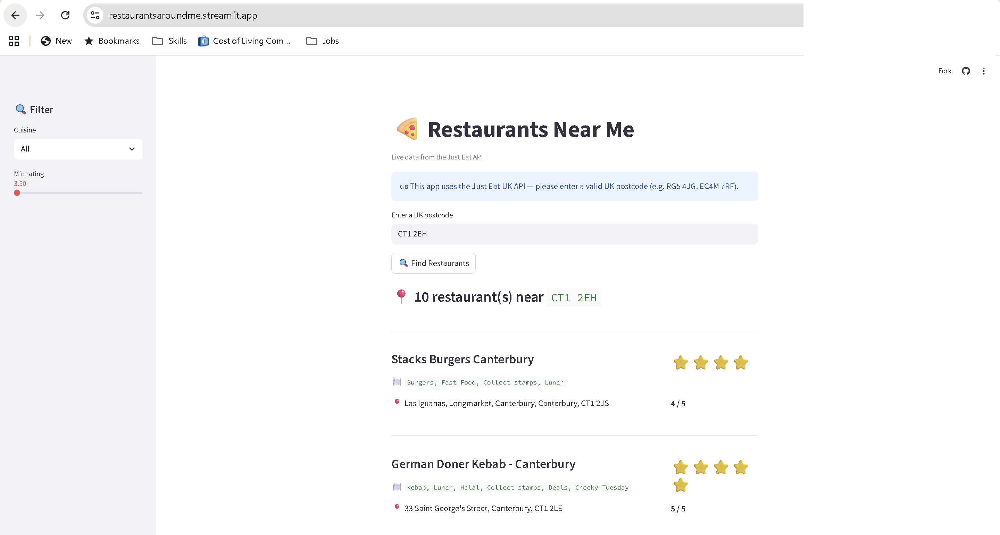

# 🍕 Just Eat Restaurant Finder

A web application that fetches live restaurant data from the Just Eat API and displays the top 10 results for any UK postcode.

## How to Run

### Option 1: View Online
The app is live and accessible at:
👉 https://restaurantsaroundme.streamlit.app/

### Option 2: Run Locally

**Prerequisites**
- Python 3.8+
- pip

1. Clone the repository:
   ```bash
   git clone https://github.com/misska7070/JustEat.git
   cd JustEat
   ```

2. Install dependencies:
   ```bash
   pip install -r requirements.txt
   ```

3. Run the app:
   ```bash
   streamlit run app.py
   ```

4. Open your browser and go to `http://localhost:8501`

Enter any UK postcode (e.g. `EC4M 7RF`, `SW1A 1AA`, or just `RG1`) and click **Find Restaurants**.

## How It Works



1. Enter any UK postcode and hit **Find Restaurants**
2. The app validates your input, then fetches live data from the Just Eat API
3. The top 10 restaurants are displayed with their name, cuisines, rating, and address
4. Use the sidebar filters to narrow results by cuisine or minimum rating

## Features

- **🔍 Smart postcode search** enter a full UK postcode like `EC4M 7RF` or just the area code like `RG1`, the app understands both
- **🇬🇧 Built for the UK** clear on-screen guidance letting you know this works with UK postcodes only, with examples to help
- **⚠️ Helpful error messages** typed something wrong? No internet? API down? You'll get a clear, specific message telling you what happened.
- **🍽️ Filter by cuisine** a dropdown that automatically populates with the cuisines available in your results, no hardcoded list
- **⭐ Filter by rating** a slider that adjusts to the actual rating range in your results, so it always feels relevant
- **🔢 Ratings shown as numbers and stars** every restaurant shows its rating as a number (e.g. `3.5 / 5`) alongside a visual star display (⭐⭐⭐✨)
- **📋 All four data points from the brief** name, cuisines, rating as a number, and address, displayed for each restaurant

## What It Does

- Sends a postcode to the Just Eat enriched restaurant API
- Extracts the following four data points from the first 10 restaurants returned:
  - **Name**
  - **Cuisines**
  - **Rating** (as a number and star display)
  - **Address**
- Displays results in a clean, interactive web interface built with Streamlit

## Assumptions

- The API endpoint `https://uk.api.just-eat.io/discovery/uk/restaurants/enriched/bypostcode/{postcode}` is publicly accessible and does not require authentication
- A `User-Agent` header mimicking a browser is required because the API rejects requests with the default `python-requests` User-Agent
- `starRating` inside the `rating` object was used as the numeric rating, as it is the most clearly user-facing metric in the response
- The API returns ratings as a mix of `int` and `float` types (e.g. `5` vs `3.5`) so all ratings are cast to `float` for consistent handling
- Restaurants missing a rating are displayed with "No rating yet" instead of a zero. Restaurants without cuisines listed show "Not listed"
- Postcodes can be entered with or without spaces as the app strips spaces before calling the API
- Only the first 10 restaurants in the response are displayed, as per the brief
- The postcode validation regex covers standard UK formats but is not exhaustive, so some edge-case valid postcodes may be rejected

## Scope for improvements

- **Unit tests** add tests for `fetch_restaurants()` and `is_valid_uk_postcode()` to verify data extraction logic and catch regressions if the API response structure changes
- **Caching** use `st.cache_data` to cache API responses for the same postcode, avoiding redundant network calls within a session
- **Sorting** let users sort restaurants by rating (high to low) or alphabetically by name
- **Pagination** extend beyond 10 results with a "load more" button that slices the next 10 from the full `restaurants` array
- **Search history** store previously searched postcodes in session_state so users can quickly switch between them
- **Map view** the API response includes `address.location.coordinates` (lat/lng) which could be plotted on a Streamlit map
- **Loading skeleton** show placeholder cards while the API request is in progress instead of a blank screen with a spinner
- **At scale: vectorised processing** for large datasets (e.g. aggregating results across many postcodes), I would use NumPy or Pandas for data extraction instead of Python loops, as vectorised operations avoid per-element Python overhead and are significantly faster for large arrays

## Tech Stack

- **Python** core language
- **Requests** HTTP calls to the Just Eat API
- **Streamlit** web interface
- **re** regex-based postcode validation
